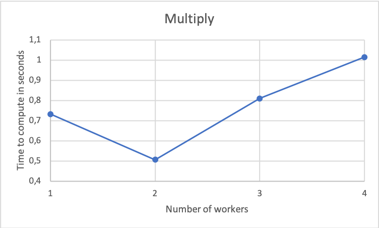
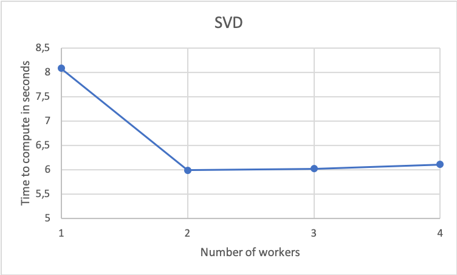
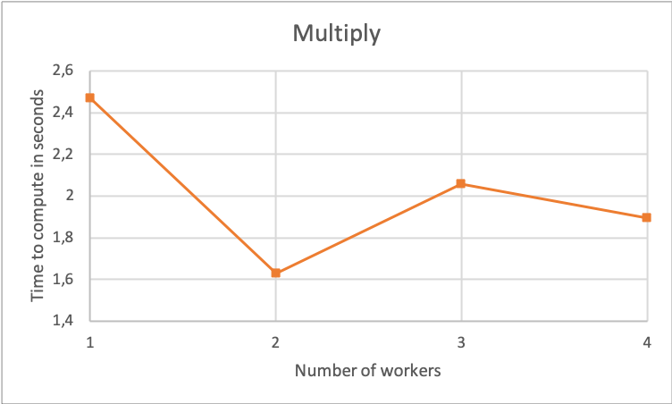
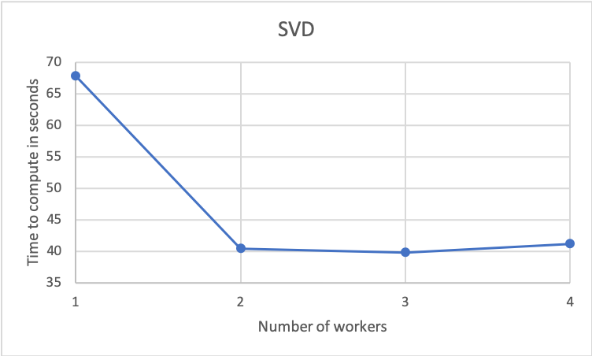

# Matrix Computation with Apache Spark in the Cloud

*Christopher Blöcker, Timotheus Kampik, Tobias Sundqvist*

This repository ([https://github.com/TimKam/wasp-cloud-course](https://github.com/TimKam/wasp-cloud-course)) contains documentation and example code for running matrix computations with Apache Spark in the cloud.
The content was produced as part of the WASP Software Engineering and Cloud Computing Course 2019.

## Problem
The problem to solve is scaling *matrix computations* with Apache Spark. Instead of just running them on a local machine, the computations are to be executed across several cloud instances to speed up execution time. To demonstrate the performance advantage of the cloud-based solution, any of the matrices that are available at [https://sparse.tamu.edu/](https://sparse.tamu.edu/) and any of Spark's [linear algebra methods](https://spark.apache.org/docs/2.2.0/api/python/pyspark.ml.html#module-pyspark.ml.linalg) can be picked. However, the choice of data set and methods should allow for a fruitful analysis.

## Choice of Methods
To assess the performance of an Apache Spark cluster with different numbers of worker nodes for a linear algebra use case, we chose the following methods:

1. **Singular value decomposition** (SVD): [pyspark.mllib.html#pyspark.mllib.linalg.distributed.RowMatrix.computeSVD](https://spark.apache.org/docs/latest/api/python/pyspark.mllib.html#pyspark.mllib.linalg.distributed.RowMatrix.computeSVD);

2. **Multiply**: [pyspark.mllib.linalg.distributed.RowMatrix.multiply](https://spark.apache.org/docs/latest/api/python/pyspark.mllib.html#pyspark.mllib.linalg.distributed.RowMatrix.multiply)

We picked the two methods, because we expect them to be commonly used in real-life scenarios.

## Choice of Data Sets
We selected two approximately medium-sized data sets by sorting the available data sets at [https://sparse.tamu.edu/](https://sparse.tamu.edu/) by number of non-zero entries.
The exact data sets we selected are:

* [https://sparse.tamu.edu/PARSEC/Si87H76](https://sparse.tamu.edu/PARSEC/Si87H76);

* [https://sparse.tamu.edu/DIMACS10/delaunay_n18](https://sparse.tamu.edu/DIMACS10/delaunay_n18).

## Setup
The Docker/Spark setup is taken from [this blog post by Marco Villarreal](https://medium.com/@marcovillarreal_40011/creating-a-spark-standalone-cluster-with-docker-and-docker-compose-ba9d743a157f).

## Execution
Build the images with `make`. Then spin up the cluster with `docker-compose up -d`. Spin up a submit container to run something in the cluster with something like

```
docker run -ti --rm --network=$NETWORK -v <script path>:/scripts spark-submit:2.3.1 /bin/bash
```

where `NETWORK` is the Docker network to which the containers are connected and `<script path>` is where the *executables* are. Find out the network with `docker network ls`.

To run the analysis code, execute:

```
python analysis.py -u <SparkUrl>
```
with `SparkUrl` being the URL to your Spark master, for example `spark://localhost:7077` if you run a local Spark cluster.

## Resources
We created a pool with 4 core nodes and gave the spark executors 8 GB memory.

## Analysis

We ran both operations on the aforementioned data sets on 1, 2, 3, and 4 (and 5 for data set 2) workers in Google Cloud.
Below are our results, averaged over 10 runs each, for the data set at [https://sparse.tamu.edu/](https://sparse.tamu.edu/):

|              | 1 Worker              | 2 Workers              | 3 Workers              | 4 Workers              |
| ------------ | --------------------- | ---------------------  | ---------------------  | ---------------------  |
| **Multiply** |  0.7329313039779664 s | 0.5070641040802002 s   |   0.8104101181030273 s |   1.015389585494995 s  | 
| **SVD**      |  8.090139007568359 s  | 5.993102312088013 s    |   6.0258043050765995 s |   6.112043023109436 s  | 





With the data set at [https://sparse.tamu.edu/DIMACS10/delaunay_n18](https://sparse.tamu.edu/DIMACS10/delaunay_n18), we got the following results:


|              | 1 Worker              | 2 Workers              | 3 Workers              | 4 Workers              | 5 Workers              |
| ------------ | --------------------- | ---------------------  | ---------------------  | ---------------------  | ---------------------  |
| **Multiply** |  2.4694278955459597 s | 1.6311752080917359 s   |     2.05913450717926 s | 1.8936052083969117 s   |   1.8766150951385498 s | 
| **SVD**      |  67.83026208877564 s  | 40.50567228794098 s    |   39.880996799468996 s |   41.2277055978775 s   |   40.89326241016388 s  |





As can be seen, both operations are fastest with 2 workers and loose speed with more workers, with the exception of data set 2, for which we receive a minor speed improvement (possibly within the margin of error) for 3 workers.
We tried a third method (principal component analysis [pyspark.mllib.linalg.distributed.RowMatrix.computePrincipalComponents](https://spark.apache.org/docs/latest/api/python/pyspark.mllib.html#pyspark.mllib.linalg.distributed.RowMatrix.computePrincipalComponents)) that would require too much memory when executed on the selected data set. We assume in most cases, memory is the bottleneck (Von Neumann bottleneck).
